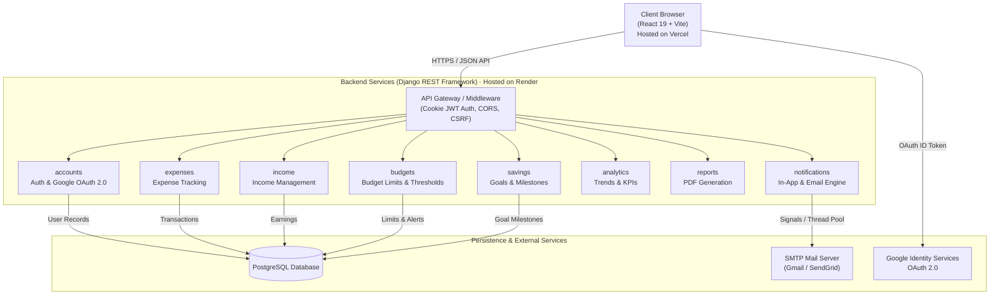

# 💳 BudgetBuddy — Intelligent Personal Finance & Budget Management

[](https://react.dev/)
[](https://vitejs.dev/)
[](https://www.djangoproject.com/)
[](https://www.django-rest-framework.org/)
[](https://www.postgresql.org/)
[](https://developers.google.com/identity)
[](https://vercel.com/)
[](https://render.com/)

BudgetBuddy is a modern, full-stack personal finance application designed to help users track expenses, manage incomes, set category budgets with proactive threshold warnings, track savings goals, and visualize financial health through interactive analytics and downloadable PDF reports.

---

## ✨ Key Features

* **🔐 Secure Dual Authentication**:
  * Standard username & password login with hashed credential storage.
  * **Google OAuth 2.0 Single Sign-On** using Google Identity Services.
  * **HttpOnly, SameSite JWT cookies** (`budgetbuddy_access`, `budgetbuddy_refresh`) protecting against Cross-Site Scripting (XSS) attacks.
* **💸 Expense & Income Tracking**:
  * Real-time expense and income logging with categorization and date filtering.
  * Automatic balance and savings rate computation.
* **🎯 Proactive Budget Management**:
  * Set monthly spending limits per category.
  * Automatic threshold detection with visual and email alert notifications when spending nears or exceeds limits.
* **🏆 Savings Goals & Progress Milestones**:
  * Create target goals, contribute funds, and track milestone percentages in real-time.
* **📊 Visual Financial Analytics**:
  * Interactive KPI cards, category distribution donuts, and monthly income vs. expense trends powered by **Recharts**.
  * Flexible time ranges (30 Days, 3 Months, 6 Months, 1 Year).
* **⚡ Asynchronous Email Intelligence**:
  * Decoupled background daemon thread email delivery prevents slow SMTP handshakes from blocking API responses.
  * Granular user email preference toggles for budget alerts, spending signals, and savings milestones.
* **📑 Automated PDF Reports**:
  * Generate and export structured financial expense reports on demand using **ReportLab**.

---

## 🏗️ System Architecture



---

## 💻 Tech Stack

| Layer | Technologies |
| :--- | :--- |
| **Frontend** | React 19, Vite 8, React Router v7, Recharts, Lucide Icons, Material-UI, Vanilla CSS3 |
| **Backend** | Python 3.12+, Django 6.1, Django REST Framework, SimpleJWT, ReportLab, WhiteNoise |
| **Database** | PostgreSQL, Django ORM |
| **Authentication** | HttpOnly Cookie-based JWT, Google Identity Services OAuth 2.0 (`@react-oauth/google`) |
| **Deployment** | Vercel (Frontend SPA), Render (Django Web Service), Supabase / Neon / Render PostgreSQL |

---

## 🚀 Getting Started Locally

### Prerequisites
* Python 3.12+
* Node.js 18+ and npm
* PostgreSQL installed and running locally

---

### 1. Backend Setup

```bash
# Navigate to the backend directory
cd backend

# Create and activate a Python virtual environment
python -m venv venv
# On Windows:
venv\Scripts\activate
# On macOS/Linux:
source venv/bin/activate

# Install dependencies
pip install -r requirements.txt

# Create your .env file from the template
copy .env.example .env

# Apply database migrations
python manage.py migrate

# Run unit tests to verify system integrity
python manage.py test

# Start the Django development server
python manage.py runserver 127.0.0.1:8000
```

---

### 2. Frontend Setup

```bash
# Navigate to the frontend directory
cd frontend

# Install Node dependencies
npm install

# Create your .env file from the template
copy .env.example .env

# Start the Vite development server
npm run dev
```

* **Frontend URL**: `http://localhost:5173`
* **Backend API URL**: `http://127.0.0.1:8000`

---

## 📡 API Endpoint Overview

| Module | Method | Endpoint | Description |
| :--- | :---: | :--- | :--- |
| **Auth** | `POST` | `/login/` | Authenticate user & issue HttpOnly JWT cookies |
| **Auth** | `POST` | `/google-login/` | Authenticate / register via Google OAuth 2.0 token |
| **Auth** | `POST` | `/register/` | Register a new user account |
| **Auth** | `GET` | `/me/` | Verify active session & retrieve user profile |
| **Auth** | `POST` | `/logout/` | Invalidate session & clear auth cookies |
| **Expenses** | `GET`, `POST` | `/expenses/` | List and create user expenses |
| **Expenses** | `PUT`, `DELETE`| `/expenses/<id>/` | Update or delete an individual expense |
| **Income** | `GET`, `POST` | `/income/` | List and create user incomes |
| **Budgets** | `GET`, `POST` | `/budgets/` | List and create category budget thresholds |
| **Savings** | `GET`, `POST` | `/savings/` | List and create savings goals |
| **Analytics**| `GET` | `/analytics/dashboard/` | Summarized financial indicators |
| **Notifications**| `GET` | `/notifications/` | List in-app notifications |
| **Email** | `GET`, `PATCH`| `/email/preferences/` | Read or update email delivery preferences |
| **Email** | `POST` | `/email/test/` | Dispatch a live test email notification |
| **Reports** | `GET` | `/reports/export/` | Download branded PDF expense report |

---

## 🛡️ Security Highlights

1. **HttpOnly Cookie Architecture**: Access and refresh tokens cannot be accessed via JavaScript (`document.cookie`), mitigating cross-site scripting (XSS) risks.
2. **SameSite & Secure Flags**: Cookies automatically use `SameSite=None; Secure=True` when running in production HTTPS mode to protect against CSRF while enabling cross-origin communication between Vercel and Render.
3. **Scoped User Queries**: All database operations query strictly through `request.user`, preventing Insecure Direct Object References (IDOR).
4. **Environment Isolation**: All sensitive credentials (`SECRET_KEY`, database credentials, SMTP tokens, Google secrets) are isolated in `.env` files and excluded from Git tracking via `.gitignore`.

---

## 📄 License
This project is developed for educational and personal finance tracking purposes.
